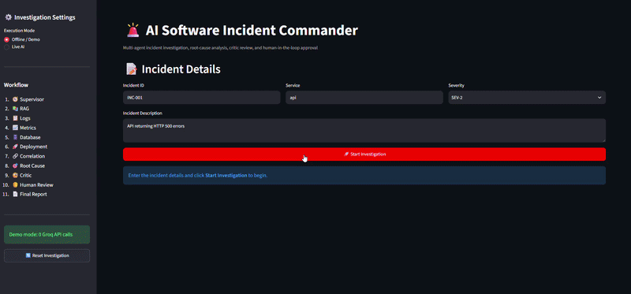
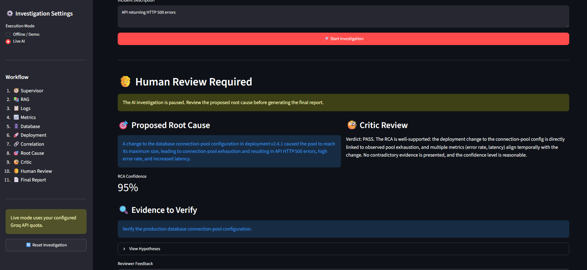
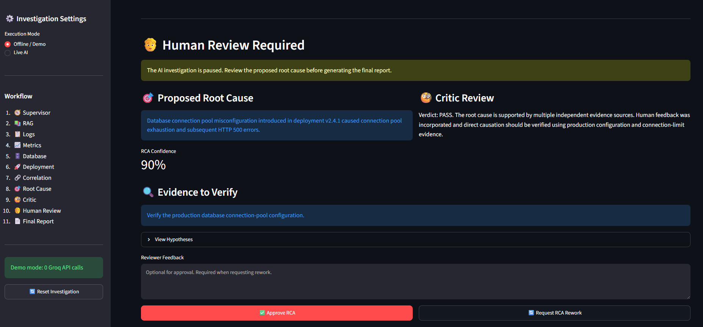
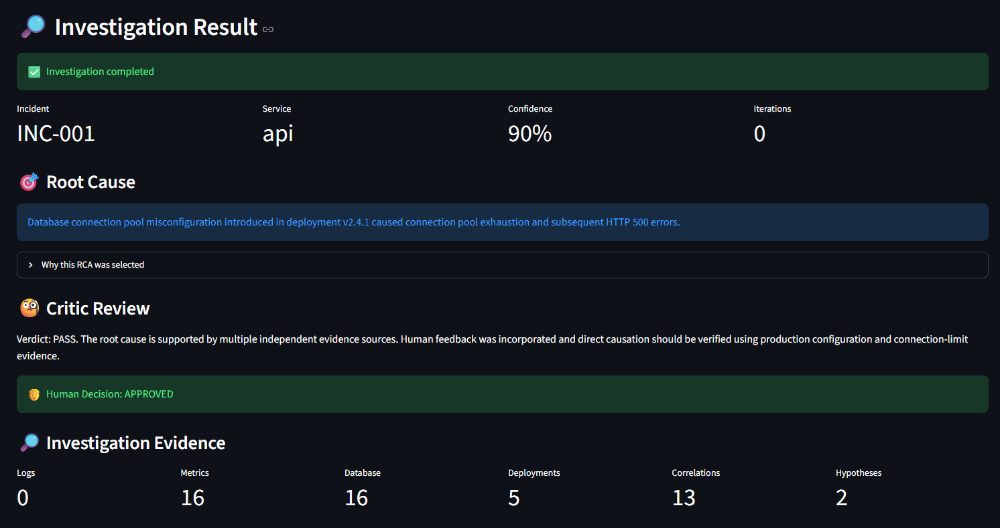
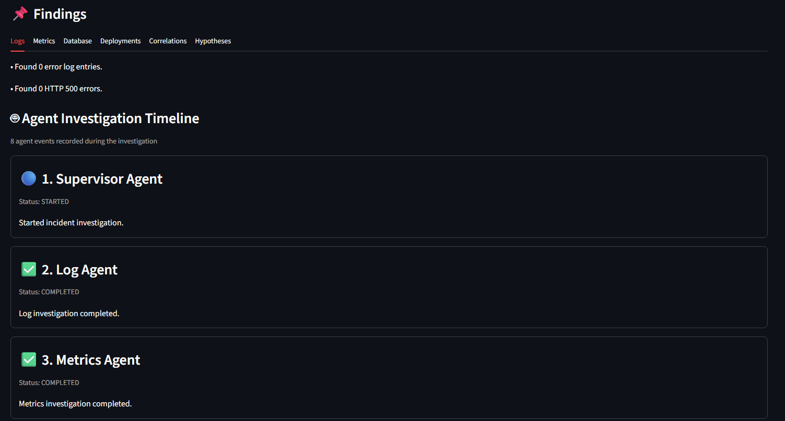

# 🚨 AI Software Incident Commander

<p align="center">
  <strong>AI-powered multi-agent system for automated software incident investigation, root-cause analysis, and human-approved incident reporting.</strong>
</p>

<p align="center">
  <a href="https://incident-commander-nxajqnrs43zdexjv43y72u.streamlit.app/">🚀 Live Demo</a>
  &nbsp;•&nbsp;
  <a href="https://github.com/Mohith2801/Incident-Commander">💻 GitHub</a>
</p>

<p align="center">


</p>

---

## 🎬 Application Demo

<p align="center">
  
</p>

The demo shows incident submission, multi-agent investigation, RCA generation, Critic validation, Human-in-the-Loop review, and final report generation.

---

## 🌐 Live Demo

🚀 **Application:**  
https://incident-commander-nxajqnrs43zdexjv43y72u.streamlit.app/

💻 **Repository:**  
https://github.com/Mohith2801/Incident-Commander

The application supports:

- 🟢 **Offline / Demo Mode** — Complete workflow without Groq API calls.
- 🟣 **Live AI Mode** — AI-powered reasoning using Groq.

---

# 📌 Overview

**AI Software Incident Commander** is a stateful multi-agent AI system designed to assist engineers during software incident investigations.

Instead of manually checking different operational sources, the system coordinates specialized agents to analyze:

- Application logs
- API metrics
- Database events
- Deployment history
- Historical incidents
- Troubleshooting documentation

The collected evidence is correlated to generate a **Root Cause Analysis (RCA)**.

A **Critic Agent** validates the RCA, and a **Human-in-the-Loop** stage allows an engineer to approve the conclusion or request rework before the final report is generated.

---

# 🎯 Problem Statement

Software incidents often require engineers to manually correlate information across multiple systems.

For example:

```text
Recent Deployment
       ↓
Database Configuration Change
       ↓
Connection Pool Exhaustion
       ↓
Database Errors
       ↓
HTTP 500 Errors
       ↓
Increased Latency
```

Identifying these relationships manually can be time-consuming.

This project automates the investigation process and presents the engineer with an evidence-based RCA.

---

# ✨ Key Features

- 🤖 **Multi-Agent Investigation**
- 📊 **Log & Metrics Analysis**
- 🗄️ **Database Investigation**
- 🚀 **Deployment Analysis**
- 📚 **RAG Knowledge Retrieval**
- 🔗 **Cross-source Evidence Correlation**
- 🎯 **Root Cause Analysis with Confidence**
- 🔍 **Critic Validation**
- 👤 **Human-in-the-Loop Approval**
- 🔄 **RCA Rework Workflow**
- 📄 **Final Incident Report**
- ⚡ **Offline / Demo Mode**
- 🧠 **Live AI Mode with Groq**
- 🖥️ **Interactive Streamlit UI**

---

# 🖥️ Application

<p align="center">
  
</p>

The interface allows users to enter incident details and start an investigation.

The workflow displayed in the application is:

```text
1. Supervisor
2. RAG
3. Logs
4. Metrics
5. Database
6. Deployment
7. Correlation
8. Root Cause
9. Critic
10. Human Review
11. Final Report
```

---

# 🏗️ Architecture

```text
                    ┌─────────────────┐
                    │  Streamlit UI   │
                    └────────┬────────┘
                             │
                             ▼
                    ┌─────────────────┐
                    │    LangGraph    │
                    │   Orchestrator  │
                    └────────┬────────┘
                             │
                             ▼
                    ┌─────────────────┐
                    │    Supervisor   │
                    └────────┬────────┘
                             │
              ┌──────────────┼──────────────┐
              ▼              ▼              ▼
            Logs          Metrics        Database
              │              │              │
              └──────────────┼──────────────┘
                             ▼
                       Deployments
                             │
                             ▼
                       RAG Retrieval
                             │
                             ▼
                    Correlation Agent
                             │
                             ▼
                    Root Cause Agent
                             │
                             ▼
                      Critic Agent
                             │
                             ▼
                      Human Review
                       ┌─────┴─────┐
                       ▼           ▼
                    Approve      Rework
                       │           │
                       ▼           └──► RCA
                  Final Report
                       │
                       ▼
                      END
```

---

# 🔄 Workflow

```text
START
  ↓
Supervisor
  ↓
RAG Retrieval
  ↓
Log Analysis
  ↓
Metrics Analysis
  ↓
Database Analysis
  ↓
Deployment Analysis
  ↓
Evidence Correlation
  ↓
Root Cause Analysis
  ↓
Critic Review
  ↓
Human Review
  ├── Approve → Final Report → END
  │
  └── Rework → Root Cause → Critic → Human Review
```

The workflow is implemented as a **stateful LangGraph graph**, allowing investigation data to be shared across agents.

---

# 🤖 Multi-Agent System

| Agent | Responsibility |
|---|---|
| **Supervisor Agent** | Coordinates the investigation |
| **Log Agent** | Analyzes application logs and errors |
| **Metrics Agent** | Investigates API performance and error metrics |
| **Database Agent** | Analyzes database events and connection failures |
| **Deployment Agent** | Investigates recent deployments |
| **Correlation Agent** | Connects evidence across sources |
| **Root Cause Agent** | Generates the most likely RCA |
| **Critic Agent** | Validates the RCA |
| **Final Report Agent** | Generates the final report |

---

# 📚 RAG Knowledge Base

The project contains a local knowledge base:

```text
knowledge/
├── incidents/
│   └── INC-0001.md
├── runbooks/
│   └── database_connection_pool.md
└── troubleshooting/
    └── http_500_database_errors.md
```

The RAG pipeline retrieves relevant historical incidents, runbooks, and troubleshooting information to provide additional context during investigation.

The implementation uses an **in-memory vector store with local embeddings**.

---

# 🔎 Evidence Correlation

The Correlation Agent combines information from:

```text
Logs
   +
Metrics
   +
Database Events
   +
Deployments
   +
Historical Knowledge
   ↓
Evidence Correlation
```

Example:

```text
Deployment v2.4.1
       ↓
Connection-Pool Configuration Change
       ↓
Connection Pool Exhaustion
       ↓
Database Failures
       ↓
HTTP 500 Errors
       ↓
Increased Latency
```

This relationship is then used to support the RCA.

---

# 🎯 Root Cause Analysis

The Root Cause Agent produces:

- Proposed root cause
- Confidence score
- Root-cause rationale
- Evidence to verify

Example:

```text
Database connection pool misconfiguration introduced
in deployment v2.4.1, leading to connection pool exhaustion
and subsequent HTTP 500 errors.
```

---

# 🔍 Critic Validation

The Critic Agent reviews the proposed RCA before it reaches human approval.

It evaluates:

- Evidence support
- Agreement between evidence sources
- Logical consistency
- Contradictory evidence
- Confidence level

Possible outcomes include:

```text
PASS
```

or RCA rework.

---

# 👤 Human-in-the-Loop

<p align="center">
  
</p>

The investigation pauses before final report generation.

The engineer can:

### ✅ Approve RCA

```text
Human Review
     ↓
Approve
     ↓
Final Report
```

### 🔄 Request Rework

```text
Human Review
     ↓
Request Rework
     ↓
Root Cause
     ↓
Critic
     ↓
Human Review
```

This ensures that AI-generated conclusions are reviewed before the final result is produced.

---

# 📊 Investigation Results

<p align="center">
  
</p>

The results page provides:

- Incident ID
- Service
- RCA confidence
- Root cause
- Critic verdict
- Human decision
- Investigation iterations
- Evidence counts
- Correlations
- Hypotheses

---

# 🧩 Agent Investigation Timeline

<p align="center">
  
</p>

The application records investigation events and displays the progress of the agents involved in the workflow.

```text
Supervisor
    ↓
Logs
    ↓
Metrics
    ↓
Database
    ↓
Deployment
    ↓
Correlation
    ↓
Root Cause
    ↓
Critic
    ↓
Human Review
    ↓
Final Report
```

---

# 📌 Example Investigation

A sample incident demonstrates the relationship between a deployment, database connection-pool problems, and HTTP 500 errors.

```text
Deployment v2.4.1
       ↓
Database Connection-Pool Configuration Change
       ↓
Connection Pool Exhaustion
       ↓
Database Errors
       ↓
HTTP 500 Errors
```

The demonstrated Live AI workflow produced:

```text
RCA Confidence: 95%
Critic Verdict: PASS
```

before reaching Human Review.

---

# 📈 Investigation Data

The project includes structured operational data:

```text
data/
├── logs/
│   └── application_logs.csv
├── metrics/
│   └── api_metrics.csv
├── databases/
│   └── database_events.csv
└── deployments/
    └── deployment_history.csv
```

These datasets simulate the types of information used during software incident investigation.

---

# ⚡ Execution Modes

## 🟢 Offline / Demo Mode

Runs the complete investigation workflow without consuming Groq API calls.

Useful for:

- Testing
- Demonstrations
- Reproducible execution
- API quota limitations

```text
Streamlit
    ↓
LangGraph
    ↓
Deterministic Investigation
    ↓
RCA
    ↓
Critic
    ↓
Human Review
    ↓
Final Report
```

## 🟣 Live AI Mode

Uses the configured Groq model for AI-powered reasoning.

```text
Streamlit
    ↓
LangGraph
    ↓
Specialized Agents
    ↓
Groq LLM
    ↓
RCA
    ↓
Critic
    ↓
Human Review
    ↓
Final Report
```

---

# 📄 Final Incident Report

After human approval, the Final Report Agent generates a structured report containing:

```text
INCIDENT FINAL REPORT

Incident ID
Service
Severity
Description
Generated At

ROOT CAUSE

Root Cause Explanation

Confidence

ROOT CAUSE RATIONALE

Evidence-Based Reasoning

CORRELATIONS

Important Evidence Relationships
```

The report can be viewed and downloaded from the Streamlit application.

---

# 🛠️ Tech Stack

| Technology | Purpose |
|---|---|
| **Python** | Core development |
| **LangGraph** | Stateful workflow orchestration |
| **LangChain** | LLM application framework |
| **Groq** | Live AI inference |
| **Streamlit** | Interactive web interface |
| **Pandas** | Data processing |
| **Scikit-learn** | Local embeddings |
| **Python-dotenv** | Configuration |
| **Git & GitHub** | Version control |
| **Streamlit Community Cloud** | Deployment |

### AI Concepts

- Generative AI
- Agentic AI
- Multi-Agent Systems
- RAG
- LLM Integration
- Prompt Engineering
- Evidence Correlation
- Root Cause Analysis
- Critic Validation
- Human-in-the-Loop
- Stateful AI Workflows

---

# 📂 Project Structure

```text
Incident-Commander/
│
├── agents/
│   ├── state.py
│   ├── supervisor_agent.py
│   ├── log_agent.py
│   ├── metrics_agent.py
│   ├── database_agent.py
│   ├── deployment_agent.py
│   ├── correlation_agent.py
│   ├── root_cause_agent.py
│   ├── critic_agent.py
│   └── final_report_agent.py
│
├── app/
│   ├── config.py
│   ├── llm.py
│   ├── graph.py
│   └── rag.py
│
├── data/
│   ├── logs/
│   ├── metrics/
│   ├── databases/
│   └── deployments/
│
├── knowledge/
│   ├── incidents/
│   ├── runbooks/
│   └── troubleshooting/
│
├── tools/
│   ├── log_tools.py
│   ├── metrics_tools.py
│   ├── database_tools.py
│   └── deployment_tools.py
│
├── tests/
│
├── ui/
│   └── streamlit_app.py
│
├── assets/
│   ├── application.png
│   ├── demo.gif
│   ├── findings.png
│   ├── human-review.png
│   └── investigation.png
│
├── test_graph.py
├── requirements.txt
├── pyproject.toml
├── .env.example
├── .gitignore
└── README.md
```

---

# ⚙️ Installation

### 1. Clone the repository

```bash
git clone https://github.com/Mohith2801/Incident-Commander.git
cd Incident-Commander
```

### 2. Create virtual environment

```bash
python -m venv .venv
```

Or:

```bash
uv venv
```

### 3. Activate environment

**Windows:**

```powershell
.venv\Scripts\activate
```

**Linux / macOS:**

```bash
source .venv/bin/activate
```

### 4. Install dependencies

```bash
pip install -r requirements.txt
```

Or:

```bash
uv pip install -r requirements.txt
```

---

# 🔐 Environment Configuration

Create a `.env` file:

```env
APP_ENV=development
LOG_LEVEL=INFO

LLM_PROVIDER=groq
LLM_MODEL=openai/gpt-oss-120b

GROQ_API_KEY=your_groq_api_key_here

MAX_EVIDENCE_ITEMS=20
CONFIDENCE_THRESHOLD=0.70

DATA_DIR=data
INCIDENTS_DIR=data/incidents
LOGS_DIR=data/logs
METRICS_DIR=data/metrics
DEPLOYMENTS_DIR=data/deployments
DATABASES_DIR=data/databases
```

For **Offline / Demo Mode**, a Groq API key is not required.

> Never commit `.env` or API keys to GitHub.

---

# ▶️ Run the Application

```bash
streamlit run ui/streamlit_app.py
```

Then open the local Streamlit URL shown in the terminal.

---

# 🧪 Testing

Run the offline integration workflow:

```bash
python test_graph.py
```

Or:

```bash
uv run python test_graph.py
```

Run the RAG module independently:

```bash
python -m app.rag
```

Or:

```bash
uv run python -m app.rag
```

---

# 🌐 Deployment

The application is deployed using **Streamlit Community Cloud**.

**Live Application:**  
https://incident-commander-nxajqnrs43zdexjv43y72u.streamlit.app/

**GitHub Repository:**  
https://github.com/Mohith2801/Incident-Commander

---

# 🚀 Future Improvements

- Real-time log streaming
- Prometheus / Grafana integration
- Kubernetes investigation
- AWS / Azure / GCP monitoring integrations
- Slack / Microsoft Teams notifications
- Jira / ServiceNow integration
- Persistent incident history
- Production-grade vector database
- Automated remediation suggestions
- Remediation with human approval
- Authentication and role-based access
- Incident analytics dashboard
- Anomaly detection
- Long-term incident memory

---

# 📌 Project Highlights

This project demonstrates practical implementation of:

- 🤖 Multi-Agent AI
- 🧠 Agentic AI
- 📚 Retrieval-Augmented Generation
- 🔗 LangGraph Workflows
- 🎯 Root Cause Analysis
- 🔍 Critic Validation
- 👤 Human-in-the-Loop
- 📊 Evidence Correlation
- ⚡ Offline / Live AI Execution
- 🖥️ Streamlit Development
- 🌐 Cloud Deployment

---

# 👨‍💻 Author

**Narra Mohith Charan**

B.Tech Information Technology  
IIIT Bhubaneswar

**GitHub:**  
https://github.com/Mohith2801

**Project:**  
https://github.com/Mohith2801/Incident-Commander

**Live Demo:**  
https://incident-commander-nxajqnrs43zdexjv43y72u.streamlit.app/

---

# ⭐ Support

If you find this project useful or interesting, consider giving the repository a ⭐ on GitHub.

---

# ⚠️ Disclaimer

This project is intended for educational, portfolio, and demonstration purposes.

AI-generated incident analysis should be independently verified by qualified engineers before being used for real production decisions.